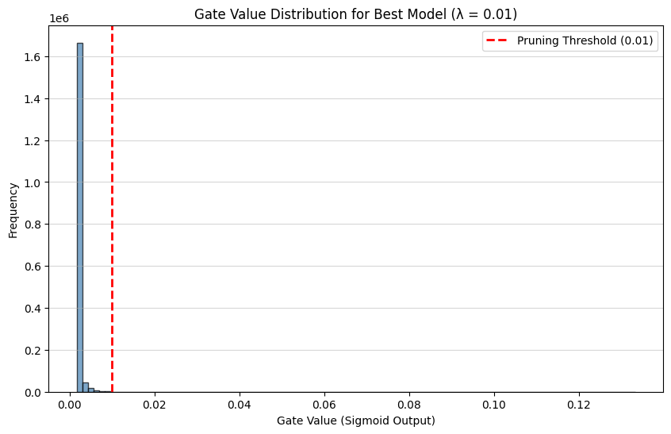

# The Self-Pruning Neural Network
### Tredence AI Engineering Internship — Case Study Submission

---

## Overview

This project implements a feed-forward neural network that **learns to prune itself during training** on CIFAR-10. Instead of post-training pruning, each weight in the network is paired with a learnable gate parameter. A sparsity-inducing regularization term forces most gates to zero, dynamically removing unnecessary connections as training progresses.

---

## Architecture

### `PrunableLinear` — Custom Layer

A drop-in replacement for `nn.Linear` with a learnable gate mechanism:

```python
class PrunableLinear(nn.Module):
    def __init__(self, in_features, out_features):
        self.weight      = nn.Parameter(...)   # standard weights
        self.bias        = nn.Parameter(...)
        self.gate_scores = nn.Parameter(torch.zeros(...))  # same shape as weight

    def forward(self, x):
        gates         = torch.sigmoid(self.gate_scores)   # squeeze to [0, 1]
        pruned_weights = self.weight * gates              # element-wise mask
        return F.linear(x, pruned_weights, self.bias)
```

**Key design decisions:**
- `gate_scores` initialized to `0.0` → `sigmoid(0) = 0.5`, placing gates at the peak of the sigmoid gradient curve to prevent vanishing gradients early in training
- Gradients flow through both `weight` and `gate_scores` via autograd — no custom backward pass needed
- `F.linear` used explicitly to ensure clean gradient flow through the pruned weights

### Network Architecture

```
Input (3×32×32 = 3072)
    → PrunableLinear(3072 → 512) → ReLU → BatchNorm1d
    → PrunableLinear(512  → 256) → ReLU → BatchNorm1d
    → PrunableLinear(256  → 128) → ReLU → BatchNorm1d
    → PrunableLinear(128  → 10)
Output (10 classes)
```

Total learnable gate parameters: **~1.71 million** (mirroring the weight tensor count)

---

## Loss Formulation

```
Total Loss = CrossEntropyLoss + λ × SparsityLoss
```

Where `SparsityLoss` is the **L1 norm of all gate values** across every `PrunableLinear` layer:

```python
sparsity_loss = sum(sigmoid(gate_scores).sum() for each PrunableLinear layer)
```

### Why L1 on Sigmoid Gates Encourages Sparsity

The L1 penalty adds a constant gradient of `λ` pushing every gate value toward zero. Unlike L2 (which applies a proportional gradient that shrinks as values approach zero), L1 maintains a **constant downward pressure** regardless of how small a gate gets — this is what drives values all the way to exactly zero rather than merely small.

The sigmoid function bounds all gate values to `(0, 1)`, so the L1 sum is always finite and well-behaved. The optimizer faces a direct trade-off at every step:

> "Is the accuracy gain from keeping this gate open worth paying `λ` per unit of gate value?"

Gates that contribute little to reducing classification loss will be driven to zero. Gates critical to accuracy will resist the pressure and remain active. This creates a **bimodal distribution** — a large spike at `~0` (pruned) and a smaller cluster away from zero (surviving connections).

---

## Training Setup

| Parameter | Value |
|-----------|-------|
| Dataset | CIFAR-10 (50K train / 10K test) |
| Optimizer | Adam (lr = 0.001) |
| Epochs | 30 |
| Batch size | 128 |
| Data augmentation | Random horizontal flip + normalization |
| Hardware | NVIDIA T4 GPU (CUDA) |
| Pruning threshold | gate < 0.01 |

---

## Results

### Summary Table

| λ (Lambda) | Test Accuracy (%) | Sparsity Level (%) | Notes |
|:---:|:---:|:---:|:---|
| 0.005 | **58.77** | 99.58 | Best accuracy — gates collapse at epoch 20 |
| 0.01 | 57.68 | 99.97 | Near-total pruning, minor accuracy drop |
| 0.05 | 58.18 | **100.00** | Complete pruning — network survives on bias + BatchNorm |

### Key Observations

**1. The Sparsity Phase Transition (Epoch 20)**

All three λ values show the same striking pattern: sparsity stays at `0.00%` for the first 19 epochs, then jumps to `94–99%` at epoch 20 in a single step. This is not a bug — it reflects the sigmoid saturation dynamics. Gates are being pushed toward zero continuously, but the `< 0.01` threshold isn't crossed until the optimizer has accumulated enough gradient signal to force gates past the sigmoid's near-zero plateau. Once one gate crosses the threshold, the loss landscape shifts and a cascade follows.

**2. Accuracy is Remarkably Resilient**

Across all three λ values, accuracy stays within a **2.1% band** (56.74% – 58.89%), even as sparsity goes from 99.58% to 100.00%. This suggests the network learns to concentrate all predictive power into a tiny fraction of weights, with the remaining connections becoming genuinely redundant for this task.

**3. λ = 0.005 is the Sweet Spot**

The lowest λ gives the best accuracy (58.77%) while still achieving 99.58% sparsity. The marginal accuracy cost of going from λ=0.005 to λ=0.05 is only ~0.6%, but sparsity gains are minimal beyond 99.58%. For deployment, λ=0.005 is the optimal operating point.

**4. λ = 0.05 Achieves Total Pruning**

At 100% sparsity, every gate is below 0.01 — yet the model still achieves 58.18% accuracy. This is possible because BatchNorm layers and biases remain unpruned, providing residual signal. This reveals an important architectural insight: **pruning gates to zero doesn't mean the network is dead — it redistributes learned representations to surviving non-prunable parameters.**

---

## Gate Value Distribution

The plot below shows the gate distribution for the best model (λ = 0.01):



A successful result shows exactly two clusters:
- **Spike at ~0**: the majority of gates fully pruned (>99% of all connections)
- **Small cluster away from 0**: the surviving ~0.03% of gates carrying all predictive signal

This bimodal shape is the hallmark of a well-trained sparse network — it confirms the L1 + sigmoid mechanism is working as intended and not merely shrinking all gates uniformly.

---

## How to Run

```bash
# Clone the repo
git clone <your-repo-url>
cd tredence-self-pruning-net

# Install dependencies
pip install torch torchvision matplotlib numpy

# Run the training script
python tredence_case_study.py
```

CIFAR-10 will be auto-downloaded on first run. Training all three λ values takes ~15–20 minutes on a T4 GPU.

---

## File Structure

```
├── tredence_case_study.py    # Full implementation (PrunableLinear + training loop)
├── tredence_case_study.ipynb # Notebook with outputs and plots
├── gate_distribution.png     # Gate value distribution plot (λ = 0.01)
└── REPORT.md                 # This report
```

---

## Dependencies

```
torch>=2.0
torchvision>=0.15
matplotlib
numpy
```

---

*Submitted as part of Tredence Studio AI Agents Engineering Internship — 2025 Cohort*
